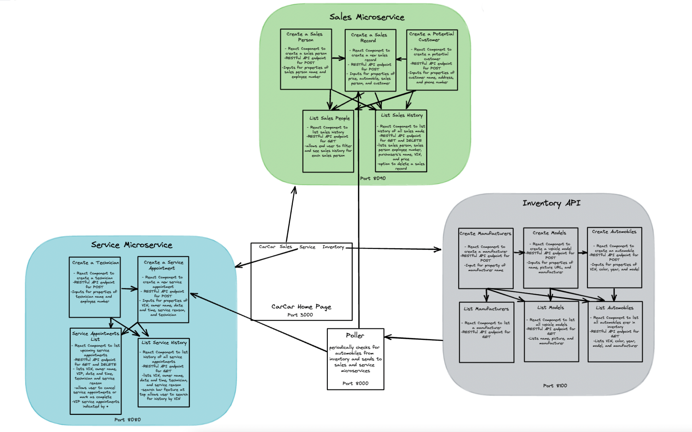

# CarCar
## Getting Started
Step - 1 : Fork This Repo / then clone the forked repo using git clone (url of http)
Step - 2 : Open the cloned repo - cd into repo then maybe use code . in terminal
Step - 3 : After it is opened, you may then look around
Step - 4 : In terminal run `docker volume create beta-data`, then `docker compose up --build`, this will create all docker containers required to run the application
Step - 5 : You can now open localhost:3000 to use said application
Step - 6 : Keep reading to see how this application is used.

Team:

* Lesley Tomosada - Service
* Tyler Dempsey- Sales

## Design


## Features

* Create & List Manufacturers
* Create & List Vehicle Models
* Create & List Automobiles in the Inventory
* Create Technicians
* Create, List, Delete, and mark as complete Appointments
* The appointments list page will will filter out any already completed appointments and also show if the car had been sold by us as indicated with the VIP section.
* Search for past Services by VIN
* Create sales person
* Create potential customers
* Create a sales record and list all sales
* Select a sales person from a drop down list and view detail of their sales

## Sales microservice
The Sales API is a microserve that consists in its own bounded content to provide the user with an interface that allows the tracking of the sales employees and their indvidual sales, customer information, and previous sale records. To do this I thought it would be best to build some models and views to interact with the database and then build out the frontend with 5 unique pages handling the creation and listing of various components.
The Backend:
The backend consists of 4 main models, AutomobileVo, Salesperson, Customer and SalesHistory and then views to handle the 5 main http requests for each sales person, sale and customer.
Integration Point: The integration point between the sales api and the inventory api is handled by the poller.py and AutomobileVO class.
Frontend:
The user interface was built using React and has the following pages which you can access from the navigation bar, Add Sales Person, List Sales Person, Add Potential Customer, List Sales History, and Create Sales record.
Challenges:
Throughout this project I achieved a greater understanding of how the frontend and backend work together, however in the future I would take more time to plan out my approach to the project. For example, what do I want the user to experience, what is that page called, how does it look? I built this project backend to front, making decisions on naming, style and sometimes functionality as I went and ran into errors. I feel like if I would have spent more time in the beginning imagining front-end to back-end while also jotting down some rules for myself that I would like to follow when it comes to naming variables I could have saved myself a lot of time chasing errors.

## Service API Overview

The service API tracks service appointments for cars and owners
Technician Tracking: http://localhost:3000/technician/new/
A form allows a user to enter a technician's identification details like name and employee number. This form is accessible through the nav bar.
Appointment Tracking: http://localhost:3000/serviceappointment/list , http://localhost:3000/serviceappointment/new/
A form allows a service advisor to enter the details of a vehicle and it's customer, such as: VIN, customer name, date/time of appointment, technician assigned, and reason for visit. This form is accessible through the nav bar.
The service section of the app shows a list of appointments, including all of the details related to the appointment. The list also includes the option to cancel an appointment or finish it (need to look up some details on how to handle this).
Service History: http://localhost:3000/serviceappointment/history
Within the service app is also the ability to track a car's service history by VIN number. The list view for this functionality is identical to the appointment tracking view, but shows appointments for a specific car both, both past and present.


## Sales Overview

The Sales Api allows you to track customers, sales made, as well as adding and search old and new sales
Sales API Overview
New Customer: http://localhost:3000/customers/
Ability to add a new customer to the system
New Sales Representative: http://localhost:3000/salespersons/create/
Add new employees to the system
New Sales: http://localhost:3000/salespersons/
Keep track of new sales being made.
Keep track of sales done by each employee.
All Sales: http://localhost:3000/saleshistory/
Keep track of all the sales done.


## Inventory API Overview:
The Inventory API allows you to add new vehicles, view all available vehicles, add and view manufacturers, as well as add and view models.
New Manufacturer: http://localhost:3000/manufacturers/new/
Add a new car brand.
All Manufacturers: http://localhost:3000/manufacturers/
View all car brands in the database.
New Vehicle Model: http://localhost:3000/models/new/
Add a new vehicle model
All Models: http://localhost:3000/models/
View all vehicle models
New Automobile: http://localhost:3000/automobiles/new/
Add a new car that comes in.
All Automobiles: http://localhost:3000/automobiles/
View all the Cars available in the dealership.

### Inventory Endpoints
**Manufacturers**
Action | Method | URL
--- | --- | ---
List manufacturers | GET | http://localhost:8100/api/manufacturers/
Create a manufacturer|POST|	http://localhost:8100/api/manufacturers/
Get a specific manufacturer|GET|http://localhost:8100/api/manufacturers/:id/
Update a specific manufacturer|PUT|	http://localhost:8100/api/manufacturers/:id/
Delete a specific manufacturer|DELETE|http://localhost:8100/api/manufacturers/:id/

These can be used as samples to create inventory data via Insomnia, if needed. 

**Create a Manufacturer**

Only the name is required to update the manufacturer: 

```
{
  "name": "Honda"
}
```

**Update a Manufacturer**
